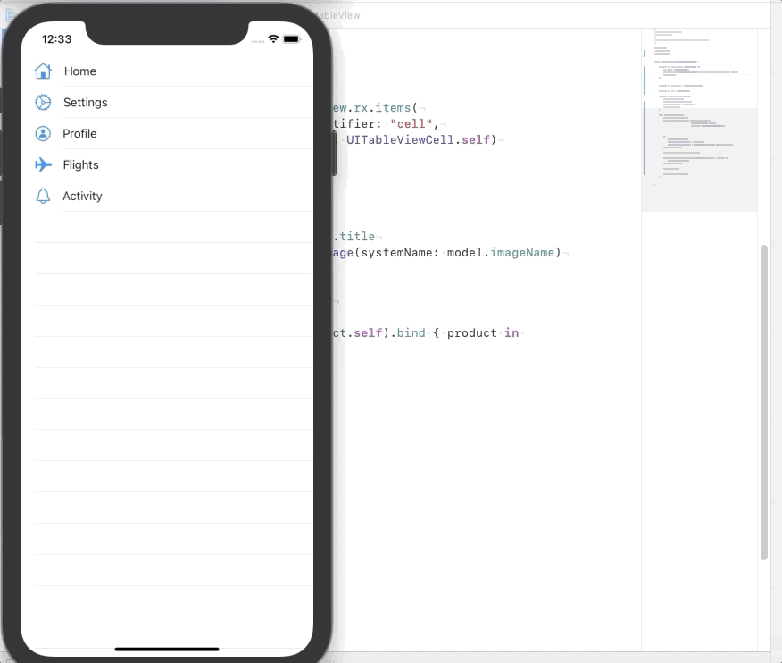

# IntroRxSwift

iOS RxSwift basic introduction project.

Swift 5+

In this application,it binds and fetchs the items in the tableview using RxSwift.

Tutorial followed:

https://www.youtube.com/watch?v=ES5RuLSv61g

